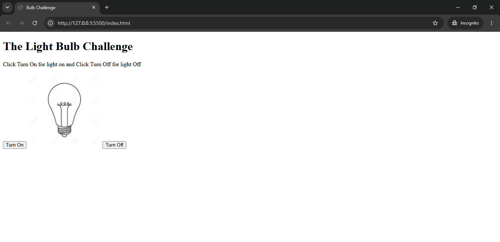

# Light Bulb Challenge

This is my first JavaScript project.

## About the Project

This project is a simple light bulb toggle app.  
You can turn the bulb ON and OFF using buttons.

## Built With

- HTML
- CSS
- JavaScript

## Features

- Turn light bulb ON
- Turn light bulb OFF
- Simple DOM manipulation

## 📸 Preview

## Author

- Rashwi Je (GitHub: @rashwije18)
